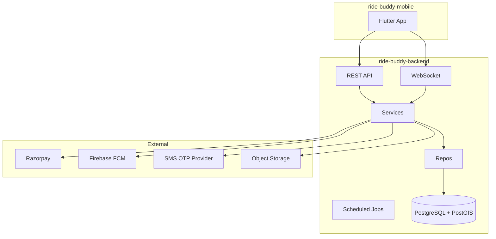

# Ride Buddy — Backend Plan

**Project:** `ride-buddy-backend`  
**Stack:** Java · Spring Boot · PostgreSQL · Docker  
**Package:** `com.alnlabs.ridebuddy`  
**Status:** Phase 0–3 API implemented (Docker SQL migrations, auth, profiles, vehicles, rides, bookings)

---

## Overview

REST (+ WebSocket) API for **Ride Buddy** — employee-focused carpool, job referrals, and meetups for India.

| Layer | Choice |
|-------|--------|
| Runtime | Java 21 |
| Framework | Spring Boot 3.x |
| Database | PostgreSQL 16 + **PostGIS** |
| Migrations | **Plain SQL files** — no Flyway, Liquibase, or Spring migration libs |
| Auth | Phone OTP + JWT (Google OAuth optional) |
| Realtime | Spring WebSocket / STOMP (chat, live location) |
| Container | Docker + Docker Compose |
| Docs | OpenAPI 3 (springdoc) |

**Mobile client:** [`../ride-buddy-mobile`](../ride-buddy-mobile) (Flutter)

---

## Architecture



---

## Product scope (API responsibilities)

### Feature 1: Ride (main)
- Multi-vehicle CRUD per owner (max 5, one primary)
- Scheduled + on-demand rides, comfort rides
- Search with commute match types (PostGIS)
- Bookings, accept/reject, pickup/drop points
- Live location ingest + broadcast
- SOS events
- Post-trip feedback (private person-to-person + app feedback)
- Trust scoring (`compute-profile-trust`) — meters + profile color
- Razorpay payments + webhooks; cash flag

### Feature 2: Job Referrals
- Job posts, referrals, status workflow
- Credit awards on milestones

### Feature 3: Meetups
- Single + combo meetups (agenda legs)
- Connect Engine: interest matching, forced reactions, escalation

### Credits
- Wallet + append-only ledger (Jobs + Meetups only; **not** rides)
- Profile strength multiplier on awards
- Phase 13: cash redemption (Razorpay X Payouts, KYC)

### NFR / Support
- `support_submissions` — feedback, feature requests, bug reports
- App version check endpoint
- Account delete + anonymize

---

## Terminology (API DTOs & docs)

| Code field | User-facing label |
|------------|-------------------|
| `owner_id` (ride / offer) | Host |
| `owner_id` (vehicle) | Owner (car ownership) |
| `passenger_id` / `co_rider_id` | Co-rider |
| Never | "driver" |

---

## Planned project structure

```
ride-buddy-backend/
├── docker-compose.yml          # postgres, app (dev)
├── Dockerfile
├── plan.md
├── sql/                        # Versioned .sql files (source of truth)
│   ├── 000_schema_migrations.sql
│   ├── 001_extensions.sql
│   ├── 002_users_profiles.sql
│   └── ...
├── scripts/
│   └── migrate.sh              # Applies pending SQL via psql (no Flyway/Liquibase)
├── src/main/java/com/alnlabs/ridebuddy/
│   ├── RideBuddyApplication.java
│   ├── config/                 # Security, WebSocket, CORS
│   ├── auth/                     # OTP, JWT, Google
│   ├── profile/
│   ├── vehicle/
│   ├── ride/
│   ├── booking/
│   ├── meetup/
│   ├── job/
│   ├── credit/
│   ├── payment/
│   ├── feedback/
│   ├── support/
│   ├── notification/
│   └── common/                 # exceptions, geo utils
├── src/main/resources/
│   └── application.yml         # spring.jpa.hibernate.ddl-auto=none
└── src/test/
```

---

## Core data model (PostgreSQL)

- `users` / `profiles` — home/office geography (PostGIS), strength, trust scores, FCM token
- `vehicles` — owner_id, nickname, make_model, plate, seats, is_primary, is_active
- `rides` — vehicle_id, comfort flags, origin/destination geography, status
- `bookings` — pickup/drop geography, status, amount
- `ride_locations` — live GPS trail
- `sos_events`
- `trip_feedback`, `feedback_themes`, `feedback_tags`, `feedback_combo_rules`, `app_trip_feedback`
- `meetups`, `meetup_agenda_legs`, `meetup_participants`, `match_prompts`
- `job_posts`, `job_referrals`
- `credit_wallets`, `credit_ledger`, `withdrawals`
- `support_submissions`
- `chat_messages` (ride/booking scoped)

---

## Database migrations (SQL files only)

**No Flyway, Liquibase, or Spring Data migration dependencies.**

| Rule | Detail |
|------|--------|
| **Location** | `sql/` at project root |
| **Naming** | `NNN_description.sql` — zero-padded order, e.g. `001_extensions.sql` |
| **Tracking** | `schema_migrations` table — filename + `applied_at` (created in `000_schema_migrations.sql`) |
| **Apply** | `scripts/migrate.sh` runs pending files via `psql` in filename order |
| **Hibernate** | `spring.jpa.hibernate.ddl-auto=none` — schema never auto-generated |
| **Docker** | Postgres container can mount `sql/` for first-time init; dev uses `migrate.sh` after boot |

### Workflow

```bash
# Start Postgres
docker compose up -d postgres

# Apply all pending migrations
./scripts/migrate.sh

# Add a new migration
# 1. Create sql/014_feature_x.sql
# 2. Run ./scripts/migrate.sh again
```

### SQL file conventions

- One logical change per file (or one phase per file)
- Idempotent where practical (`CREATE TABLE IF NOT EXISTS`, guarded `ALTER`)
- PostGIS extension in early numbered file (`CREATE EXTENSION IF NOT EXISTS postgis`)
- No generated migration output from JPA — hand-written SQL only

---

## API conventions

- Base path: `/api/v1`
- Auth: `Authorization: Bearer <jwt>`
- Pagination: `page`, `size`
- Geo: WGS84; radius search via PostGIS `ST_DWithin`
- Errors: RFC 7807 Problem Details
- Idempotency keys on payments

---

## Docker (dev)

```yaml
# docker-compose.yml (planned)
services:
  postgres:
    image: postgis/postgis:16-3.4
    ports: ["5432:5432"]
  api:
    build: .
    ports: ["8080:8080"]
    depends_on: [postgres]
```

---

## Phased delivery

| Phase | Backend scope |
|-------|----------------|
| **0** | Spring Boot scaffold, Docker Compose, `sql/` + `migrate.sh`, health check, OpenAPI |
| **1** | Auth (OTP + JWT), profiles, places, interests, profile strength |
| **2** | Vehicles CRUD, rides posting, owner dashboard APIs |
| **3** | Search, booking, commute match, WhatsApp share payload |
| **4** | — (maps client-side; backend stores geo only) |
| **5** | Chat WebSocket |
| **6** | Live location WebSocket, SOS |
| **7** | Feedback APIs, trust computation job |
| **8** | Razorpay orders, webhooks |
| **9** | FCM push service |
| **10** | Support submissions, delete account, legal content endpoints |
| **11** | Meetups + Connect Engine |
| **12** | Credits wallet + ledger |
| **13** | Job referrals + payout redemption |

---

## External setup

1. PostgreSQL + PostGIS (Docker locally)
2. SMS provider for OTP (e.g. MSG91 / Twilio)
3. Razorpay keys + webhook URL
4. Firebase Admin SDK for FCM
5. Object storage (S3 / MinIO) for profile photos & screenshots
6. Sentry (optional server-side)

---

## Security

- JWT short-lived access + refresh tokens
- Rate limit OTP and on-demand ride requests
- Plate numbers only after booking accepted
- Credits: server-side grants only; ledger append-only
- PII scrubbing in logs

---

## Not in scope yet

- Implementation / code generation
- CI/CD pipelines
- Production Kubernetes
